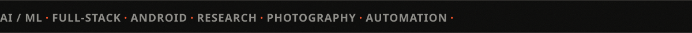

[`mosambiswas.com`](https://www.mosambiswas.com/) · [`sheichobi — photography`](https://www.mosambiswas.com/sheichobi/sheichobi.html) · [`linkedin`](https://linkedin.com/in/mosambiswas) · [`g.dev`](https://g.dev/MosamBiswas) · [`mail`](mailto:mosambiswas999@gmail.com)

### `(01) — SELECTED WORK`

| `PROJECT` | `WHAT IT IS` | `BUILT WITH` |
| :-- | :-- | :-- |
| [**MindFirst**](https://github.com/Aaditdot-1234/Mind-First) | Mental-health triage — AI chatbot + psychometric screening in one platform | `Next.js` `Flask` `ML` |
| [**IntelliStatement**](https://github.com/Rcidshacker/LLM-bank-statement-analyzer) | Bank statements in, financial insight out — LLM extraction from PDFs & images | `FastAPI` `Streamlit` `LLM` |
| [**Rail Mitra**](https://github.com/SAHILJAIN06/RailMind) | Railway platform & track assignment, solved as constraint programming | `Python` `OR-Tools` |
| [**PixelForge**](https://github.com/SAHILJAIN06/PixelForge) | Leukemia image classification with CNNs, GAN-augmented on C-NMC | `PyTorch` `GANs` |
| [**Sim Sim**](https://github.com/aryannaik225/SimSim-Virtual-Assistant) | Voice-driven desktop assistant with a native GUI | `Python` `PySide6` |
| [**Committee Connect**](https://github.com/BiswasMosam/CommitteesManagement) | Task & attendance tracking for college committees | `Android` `Firebase` |

The rest — ArtScape, To-Do, and the site itself — lives at [`mosambiswas.com`](https://www.mosambiswas.com/).

### `(02) — RESEARCH`

[**Comparative Analysis of Psychometric Data for Mental Health Assessment**](https://www.mosambiswas.com/ResearchPaper.pdf) — ICAIIHI-2025.
PHQ-9 / GAD-7 psychometrics through five supervised models at ~99% accuracy, kept interpretable with SHAP — a smarter first step for mental-health triage.

### `(03) — STACK`

`Python` `Java` `JavaScript` `C++` — `PyTorch` `Next.js` `Flask` `FastAPI` `Node` — `Firebase` `MongoDB` `Android` `Git`

Currently deep in: `LLMs` · `computer vision` · `system design`

### `(04) — OFF SCREEN`

Street, portraits, monochrome, concerts, wildlife. Technical Head, Photocircle RAIT ’22–’25.
The archive is [**SheiChobi**](https://www.mosambiswas.com/sheichobi/sheichobi.html) — Bengali for *“that picture.”*

 

`© 2026 MOSAM BISWAS — NAVI MUMBAI, IN` · `NO TEMPLATES, NO WIDGETS — BUILT BY HAND`

